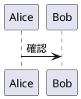

# kMark

kMark はローカルの Markdown 文書を編集しながらプレビューできるエディター。デスクトップアプリ（Tauri）とブラウザ版を持つ。Markdown に `<!-- kmark ... -->` を書くと、装飾・図表・用紙・印刷の設定も文書に保存できる。

## 目次

- [使い始める](#使い始める)
- [画面とファイル操作](#画面とファイル操作)
- [Markdown と kmark 拡張](#markdown-と-kmark-拡張)
- [プレビューと印刷](#プレビューと印刷)
- [設定と外部連携](#設定と外部連携)
- [開発](#開発)
- [困ったとき](#困ったとき)

## 使い始める

### インストールして起動

1. [GitHub Releases](https://github.com/Ki2Neon/kMark/releases) から使用する OS 向けの配布物を取得する。配布ビルドの対象は Windows x64、macOS（Apple Silicon / Intel）、Linux x64。
2. インストールまたは展開して `kmark` を起動する。Windows では WebView2 Runtime が必要。
3. `Edit` に Markdown を入力する。右の `Preview` に結果が反映される。
4. `Ctrl+Shift+B`（macOS は `⌘+Shift+B`）でメニューを開き、**ファイル → 名前を付けて保存** で `.md` に保存する。

ソースから試す場合は[開発](#開発)を参照。ブラウザ版ではファイル操作や OS 連携に[差分](#ブラウザ版とデスクトップ版の違い)がある。

### 最初の文書

以下を `Edit` に貼り付け、`Preview` を確認する。

````markdown
# 作業メモ

これは **重要** な項目。詳しくは [参考リンク](https://example.com)。

- [ ] 確認する
- [x] 完了した

| 項目 | 値 |
| --- | --- |
| 状態 | 作成中 |

<!-- kmark color:#c00 font_weight:bold -->
提出前に再確認


````

## 画面とファイル操作

- **Edit**: CodeMirror による編集。Markdown の補完、表の編集補助、kmark 指定の補完と警告を利用できる。
- **Preview**: 入力内容をライブ表示。編集中の行を追跡し、プレビュー内の内容をダブルクリックすると対応する編集行へ移動する。
- **メニュー**: ファイル操作と表示設定。PC レイアウトでは開閉でき、メニュー上部で設定名を検索できる。
- **PC / Mobile レイアウト**: PC では Edit と Preview を並べて表示し、境界をドラッグして幅を調整する。Mobile では下部の `menu` / `edit` / `preview` から画面を切り替える。メニューの **表示モード** から手動変更も可能。
- **プレビュー非表示**: メニューの **プレビュー → 表示** を切り替えると Edit に集中できる。

### ファイルを扱う

メニューの **ファイル** から **開く**、**上書き保存**、**名前を付けて保存**、**新規作成**、**印刷** を実行する。デスクトップ版では **最近開いたファイル** と **.mdのフォルダーを開く** も使える。デスクトップ配布物には `.md` のファイル関連付け設定が含まれる。

| 操作 | Windows / Linux | macOS |
| --- | --- | --- |
| 新規作成 | `Ctrl+N` | `⌘+N` |
| 開く | `Ctrl+O` | `⌘+O` |
| 上書き保存 | `Ctrl+S` | `⌘+S` |
| 印刷 | `Ctrl+P` | `⌘+P` |
| メニュー切替 | `Ctrl+Shift+B` | `⌘+Shift+B` |

`Esc` でメニューを閉じる。未保存の変更がある文書を閉じたり置き換えたりする際は確認が入る。編集中の内容はローカル下書きとして保持されるが、**下書きの自動保持は `.md` ファイルへの保存ではない**。他のアプリで使う文書は明示的に保存する。

### 画像などのローカル素材

通常の Markdown 画像記法 `` を使用する。デスクトップ版で保存済み文書を開いている場合、相対パスはその `.md` の場所を基準に解決される。デスクトップ版では、保存済み `.md` の Edit に画像等を貼り付けたりファイルをドロップしたりして素材を取り込める。先に文書を保存してから取り込む。ブラウザ版ではローカルパスの扱いが異なるため、確実に相対参照を使うにはデスクトップ版で文書と素材を同じ作業フォルダーに置く。

### ブラウザ版とデスクトップ版の違い

| 項目 | デスクトップ版 | ブラウザ版 |
| --- | --- | --- |
| Markdown の読込・保存 | OS のファイル選択と実ファイルへの保存 | 対応ブラウザでは File System Access API、その他はファイル選択・ダウンロード |
| 下書き | アプリのローカル状態 | ブラウザのローカルストレージ |
| ローカルパス・OS 連携 | 利用可能 | 制限あり |
| 外部 REST / MCP API | 利用可能 | 利用不可 |

ブラウザでファイルを選んだだけでは元ファイルに書き戻せない環境がある。その場合の保存はダウンロードになる。ブラウザの保存データを消すと下書きも失われる。

## Markdown と kmark 拡張

見出し、段落、リスト、リンク、画像、表、チェックリスト、脚注、取り消し線、コードブロックに対応。`mermaid`、`plantuml`、`dot` のコードフェンスは図としてプレビューする。安全でない HTML やリンクはレンダラーが抑制する。

### 図とメディア

図はコードフェンスの言語名で指定する。例えば PlantUML は次の形式。

````markdown

````

Mermaid の例は[最初の文書](#最初の文書)に記載。Graphviz の図は `dot` フェンスを使う。動画と 3D モデルは画像記法で拡張子から判別される。

```markdown


```

`NOTE`、`TIP`、`IMPORTANT`、`WARNING`、`CAUTION` の callout も利用可能。

```markdown
> [!WARNING] 作業前に確認
> 電源を切る
```

### 直後のブロックを装飾する

`<!-- kmark key:value ... -->` を対象ブロックの直前に置く。間に空行を入れると単発指定は効かない。

```markdown
<!-- kmark color:#c00 font_size:14pt font_weight:bold -->
重要な本文

<!-- kmark w:80mm align:center -->

```

続けて書いた複数の kmark コメントは結合され、同じキーは後の指定が優先される。編集欄で `<!-- kmark ` と入力するとパラメータ候補が出る。不明なキーや一部の不正値は警告される。

### 複数ブロックをまとめる

`{` でスコープを開始し、別行の `<!-- kmark } -->` で終了する。スコープは入れ子にできる。

```markdown
<!-- kmark { color:#900 border_size:1px border_color:#c88 padding:2mm -->
本文 A

## 見出し B
<!-- kmark } -->
```

### 用紙、改ページ、目次

メニューの **プレビュー → 表示形式 → 用紙** にすると用紙サイズ・余白・ページ番号を確認できる。内容が収まらない場合はページが自動追加される。単独行の `<!-- --- -->` は手動改ページ。用紙表示と印刷に反映される。

```markdown
<!-- kmark { page_size:A4 orientation:portrait page_margin:16mm page_number:bottom-center page_number_format:"{page} / {total}" -->
<!-- kmark toc:true toc_title:"目次" toc_depth:3 -->
# 第1章
本文

<!-- --- -->

# 第2章
続き
<!-- kmark } -->
```

装飾、画像、表、レイアウト、目次、用紙の詳しい使用例は [利用マニュアル](Manual/kmark-user-manual.md)。動画・3D モデルを含む全パラメータのキー・値・別名は [パラメータ一覧](Manual/kmark-parameter-reference.md)。実装に沿った表示差と制限は [現行動作調査](Manual/kmark-current-usage-report.md) を参照。

## プレビューと印刷

- **通常**: 連続した HTML プレビュー。Markdown と kmark 装飾、図、画像を確認する。
- **用紙**: ページ単位で表示。A4 などの用紙設定、余白、ページ番号、目次のページ番号を反映する。
- **印刷 / PDF**: メニューの **ファイル → 印刷** から OS / ブラウザの印刷画面を開く。PDF が必要なら印刷先で PDF 保存を選ぶ。現在の表示形式（通常 / 用紙）に合わせて印刷する。
- **操作**: プレビューの右クリックメニューから `Fit`、用紙表示時の `Fit All` を選べる。メニューの **サブウィンドウを開く** でプレビューを別窓に表示でき、別窓の右クリックメニューには全画面表示もある。

PlantUML の再描画が必要ならメニューの **PlantUMLを再生成** を使用する。外部 HTTPS リソースを図で参照する場合は **PlantUML HTTPS Host** に許可するホストを設定する。図の描画はローカル実行が基本で、参照先の取得にはネットワーク接続が必要。

## 設定と外部連携

メニューからプレビューの配色、行番号、長い行の折り返し、編集とアプリのフォント・サイズ、アプリテーマ、追加カーソルの修飾キーを変更できる。**起動時の表示** は「スタートページ」または「無地」。Windows では **Windows 起動時の常駐** も設定できる。

デスクトップ版の **外部API** は初期状態で停止。必要な場合だけ Server を起動し、ファイル選択画面から公開 Root を追加する。ローカル REST API と同梱の MCP アダプターから文書の参照・変更提案・検証を行える。外部からの変更は提案としてアプリで確認する。設定例、API、権限境界は [外部 API / MCP ガイド](docs/external-api-mcp.md) を参照。

## 開発

### 必要環境

- Node.js 24、pnpm 10（`package.json` の `packageManager` は `pnpm@10.15.1`）
- Rust stable、`wasm32-unknown-unknown` target、`wasm-pack`
- デスクトップ版: Tauri v2 の OS 別ビルド環境。Windows は Microsoft Edge WebView2 Runtime も必要
- ブラウザテスト: Playwright Chromium（`pnpm exec playwright install chromium`）

### 起動とビルド

Rust と Node.js / pnpm を導入後、リポジトリのルートで準備する。

```powershell
rustup target add wasm32-unknown-unknown
cargo install wasm-pack --version 0.14.0 --locked
pnpm install --frozen-lockfile
```

ブラウザ版を開発する場合:

```powershell
pnpm dev
```

Vite の開発サーバーは `http://localhost:1420`。Rust Web Core を変更した後は `pnpm build:wasm` を再実行する。

デスクトップ版を開発する場合:

```powershell
pnpm build:mcp-sidecar   # 初回と MCP sidecar 変更後
pnpm tauri dev
```

`pnpm tauri dev` は WASM を再生成する。配布物のビルドは次のいずれかを実行する。

```powershell
pnpm build:web           # ブラウザ版を dist/ に生成
pnpm tauri build         # WASM と MCP sidecar を含むデスクトップ配布物を生成
```

### テストと Contract

```powershell
pnpm test                 # Rust Core / Application + TypeScript Unit
pnpm test:browser         # WASM を再生成してブラウザ統合テスト
pnpm test:tauri:smoke     # 実 Tauri / WebView2 の主要経路（Windows）
pnpm typecheck
pnpm lint
pnpm check:contracts
```

テスト環境、全コマンド、失敗時の成果物は [テスト基盤](docs/testing.md)。Rust の公開 Contract から TypeScript DTO を更新するときは `pnpm generate:contracts` を使う。

### Architecture Core

- `crates/kmark-core`: Markdown / kmark の解析・描画と文書規則
- `crates/kmark-application`: 文書セッション、revision、変更提案などの UseCase
- `crates/kmark-web`: Core をブラウザで動かす WASM Adapter
- `src/domain` / `src/application`: UI から独立した型、状態遷移、Port

### Tauri Adapter

- `src-tauri`: Rust command、ローカルファイル、OS 連携、デスクトップの正準文書状態
- `src/adapters` / `src/ui`: 実行環境との接続、入力受付と表示
- `crates/kmark-contract` / `src/contracts/generated`: Rust と Frontend 間の DTO
- `crates/kmark-rest` / `crates/kmark-mcp`: 外部 REST / MCP 境界

依存方向、文書状態、IPC 規則は [アーキテクチャ](docs/architecture-dsa.md) を参照。

## 困ったとき

| 症状 | 確認すること |
| --- | --- |
| kmark 指定が効かない | コメントと対象ブロックの間の空行、キーと値、スコープ終端を確認する |
| ページ番号が見えない | プレビュー表示形式を「用紙」にする |
| 画像が見えない | デスクトップ版では `.md` から見た相対パスとファイルの存在を確認する |
| ブラウザで上書きできない | File System Access API のない環境では保存結果がダウンロードになる |
| 図の表示が更新されない | PlantUML は「PlantUMLを再生成」を使う。外部リソースは許可 Host と接続を確認する |

## ライセンス

本体は MIT License。詳細は [LICENSE](LICENSE) と [第三者ライセンス情報](THIRD-PARTY-NOTICES.md)。
