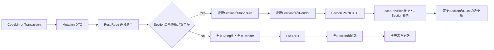

# Source Section 差分Preview 実装計画

## 結論・成功条件

明示改ページ `<!-- --- -->` で区切る Source Section を差分更新の単位にする。通常のSection内編集では、Ropeの該当区間だけを文字列化・Render・転送し、変更Sectionの表示だけを置換する。編集前後で境界や文書全体の依存関係が変わる場合は、影響する後続Sectionまたは全文へ安全に拡大する。

成功条件: 複数Sectionの通常本文編集で、全文String化・全文Markdown走査・全Section Render・全Page DTO転送・無関係なDOM再生成が発生しないことを計測と試験で示す。既存の全文Render結果と表示が一致すること。

## 着手前に確認した状態

- `EditorDocument` はRopeを保持し、CodeMirror由来のUTF-16 Mutation Batchを原子的に適用する。
- Preview commandはSessionの全文 `String` Snapshotを作る。3Dモデル参照収集も全文を受け取る。
- Rendererは全文から目次・見出し番号を収集し、明示改ページとPage設定境界で全Pageに分割して各PageをRenderする。
- Standard応答は全HTMLを連結し、A4応答は全Pageを返す。Web Workerも全文SnapshotからRenderする。
- A4 UIは全Pageを表示し、受信済みPageの寸法・配置を計測する。自動Page追加は未実装。
- Rope上の明示改ページ索引・範囲抽出APIは追加済みだがPreview経路には未接続。索引生成は現状、全文の行走査。

## Architecture Core

### 境界とState

- Source Section = 明示改ページ間のソース。空Sectionも保持。SectionとRendererのPage、および将来の物理A4 Pageは別概念。
- Section索引はRope文字範囲、絶対開始行、revisionを保持する。UTF-16 Mutation座標をRope文字座標へ変換する責務はCore側に限定する。
- SessionごとのPreview Stateは `revision + Section索引 + Section描画結果 + 文書共通Context + file path/表示設定` を持つ。UIへ正準本文の判断を委譲しない。
- 明示改ページの判定は既存Rendererと同一。fence内・複数行HTMLコメント内・インデント付きの見かけ上のマーカーは境界にしない。
- Page設定による暗黙の分割はSection内で処理し、1 Sectionから0個以上のRendered Pageを出す。

### 失効規則

1. Mutation前のSection索引で変更範囲を特定し、適用後のRopeで境界を再検査する。複数Cursor・複数TransactionはBatch全体を単位として扱う。
2. 境界数・位置関係が不変ならSection順序を維持する。変更Sectionだけを再抽出し、未変更SectionのRender結果を共有する。
3. 変更により後続Sectionの絶対行、継承Page設定、Mermaid/生成SVG連番、見出し番号、目次、参照定義などが変化する場合は依存先まで失効範囲を拡張する。判定不能なら全文Fallback。
4. 改ページの追加・削除、Sectionをまたぐ編集、file path/モデル解決設定の変更、Session切替はFull応答で再同期する。
5. stale revision、重複Batch、Render中の再編集では古い結果を確定・表示しない。Cache更新はSession IDとrevision一致時のみ。

### Render経路

- 既存全文APIは正しさの基準として維持。文書共通Context収集とSection単位Renderを内部で分離する。
- 通常経路では対象SectionのRope sliceだけをString化する。文書共通ContextはSectionの要約を再利用し、通常編集で全文走査しない。
- モデル参照のない通常本文編集では、別Sectionに解決済みモデルがあってもその解決結果を再利用する。モデル参照・変換設定・file path変更は全文Fallbackとする。
- 最初の局所更新許可条件は保守的に定義する。条件を満たさない編集は全文APIへ戻す。許可条件は差分比較試験が通ったものだけ拡張する。

## Tauri Adapter とView

- Preview commandはRequest/Responseを維持する。初期表示・再同期はFull、通常編集は `baseRevision + revision + sectionIndex + 当該SectionのPage群` のPatchを返す。Tauri固有型はCoreへ入れない。
- Rust Applicationはロック下でrevision一貫のRope-backed Snapshotを得てからRenderする。重いRender中にSessionのロックを保持しない。
- FrontendはPatchの `baseRevision` が表示中revisionと一致する場合だけView Stateへ適用。不一致ならFullを要求する。Markdown意味解析は行わない。
- A4はSection内Page群だけ置換し、未変更SectionのDOM identityを維持する。Page番号など派生表示は必要範囲のみ更新する。
- StandardはSection単位のHTMLを保持・描画し、無関係なDOMを更新しない。既存SubWindow契約向けの全文HTML連結は維持する。
- Mermaid/PlantUML/メディアURLの後処理はPatch Sectionだけに適用。旧非同期処理の完了はrevision guardで破棄する。
- Web Worker/WASMも同じCore判定・Full/Patch契約を使用する。Desktop専用の意味規則を作らない。

## 小さい実装単位

各単位をビルド・試験可能な状態で終える。ここではGit commit自体は行わない。

1. **索引の基礎** — Rope区間APIと境界試験。完了済み。
2. **Baseline比較器** — 全文Renderer結果をSection単位に対応付ける試験fixtureを用意。HTML、Page設定、行番号、図IDを比較する。
3. **Core Render分離** — 文書共通ContextとSection Renderの内部interfaceを定義。全文Facadeの出力完全一致を確認。
4. **Mutation影響範囲** — UTF-16 Batchから変更前後のSection範囲を返すCore APIを追加。複数変更、改ページ、Unicode、CRLFを試験。
5. **Section索引差分更新** — 通常編集では対象付近のみ再走査して後続offsetを補正。境界変更時は全索引を再構築。
6. **依存失効** — Section要約と文書共通Contextの失効規則を実装。行数変化・見出し・TOC・Page設定・脚注・参照・図連番などの反例を試験。
7. **Rust Session Cache** — revision付きSection結果をSessionで保持。通常編集で対象SectionのみRender。Race・Session切替・Cache破棄を試験。
8. **モデルAsset** — 通常本文Patchは既存解決結果を再利用。参照または変換設定の変更は全文Fallback。Section別の参照収集は将来の最適化。
9. **Full/Patch契約** — 生成TypeScript型付きDTOを追加。旧全文Preview APIは残し、新しいSession Preview応答を分離。
10. **Tauri接続** — Rope-backed SnapshotからFull/Patchを返す。全文 `session_for_ui()` を通常Preview経路から除去。
11. **Frontend View State** — baseRevision検証、Section置換、Full再同期、Patch単位の後処理を実装。
12. **A4/Standard表示** — Section由来Page群の安定keyと表示を実装。未変更SectionのDOM非再生成を検証。
13. **Web parity** — Worker/WASMにも同じCore Stateと契約を接続。
14. **性能・回帰** — 約1 MiB/5 MiB、改ページあり/なしでEnd-to-End Render時間とDTOサイズを比較。各段階の細分計測は将来の最適化用に残す。

## Verification

- 既存全文APIをOracleとして、編集の前後でFull結果とPatch適用結果を比較する。内部実装ではなくHTML、Page設定、絶対Source行、リンク・目次・脚注、図ID、Page番号を確認。
- 境界: 先頭/末尾/連続改ページ、fence/コメント内マーカー、Page設定Scope、空Section、改ページなし、複数Cursor、改行増減、emoji、CRLF、改ページの追加削除。
- 競合: 連続入力、stale revision、旧非同期メディア処理、Session切替、Render中の編集、Cacheの破棄・再構築。
- `cargo test -p kmark-core`、Application/Contract/Tauri試験、`pnpm run check:contracts`、`pnpm run typecheck`、A4 Preview試験、Web Worker試験を段階ごとに実行。
- 複数Sectionの通常編集では `full_snapshot=0`, `full_render=0`, `changed_sections=1`, `patch_sections=1` を検証。単一Section、境界・共通依存変更ではFullを正規経路とする。

## Out of Scope

- 自動改ページの実装。将来は1 Source Sectionから複数物理Pageへの導出として接続する。
- Markdown文法や明示改ページ記法の変更。
- 新しい外部依存の導入。

## Progress

- 1–7、9–13: 実装・試験済み。Coreの全文RenderをOracleとしたPatch比較、revision不一致時Full再同期、Tauri/Web共通契約、Standardの実ブラウザDOM同一性を確認。生成SVGは共有Cacheの競合を避けてSection順に後処理する。
- 8: 安全な範囲で実装。モデル参照を変更しない本文Patchでは解決済み結果を再利用。参照変更はFullに戻す。モデル変換をSection単位へ分割する最適化は未実装。
- 14: 約0.92 MiB/4.58 MiBで計測。64/320 Sectionでは対象1 SectionのみPatch。改ページなしは全文Renderへ直行。Snapshot・索引・Context・DOMの個別時間計測は未実施。
- 将来の自動改ページは `Source Section -> Rendered Page群 -> 物理Page群` に追加する。現時点のPatchはRendered Page群の置換まで。
