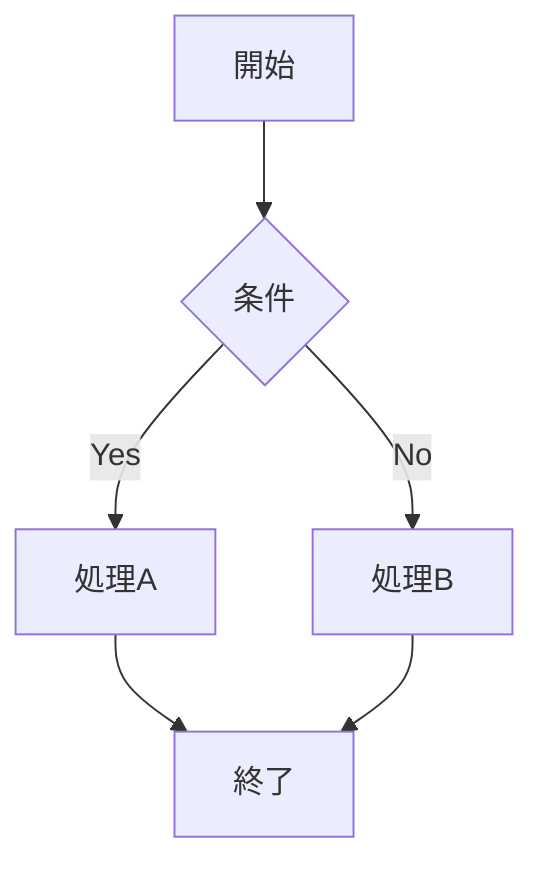

# Markdown 標準機能・拡張機能テスト

この文章は、Markdown の基本機能と、よく使われる拡張機能が正しく表示されるか確認するためのテスト文書です。

---

## 1. 見出し

# H1 見出し
## H2 見出し
### H3 見出し
#### H4 見出し
##### H5 見出し
###### H6 見出し

---

## 2. 段落と改行

これは通常の段落です。Markdown では、空行で段落が分かれます。

これは別の段落です。  
この行は末尾に半角スペース2つを入れているため、改行される想定です。

これは
通常の改行だけを含む文章です。
レンダラーによっては同じ段落として扱われます。

---

## 3. 強調

これは *斜体* です。  
これは _斜体_ です。

これは **太字** です。  
これは __太字__ です。

これは ***太字かつ斜体*** です。  
これは ___太字かつ斜体___ です。

これは ~~取り消し線~~ です。  
※取り消し線は GFM 系の拡張です。

---

## 4. インラインコード

C言語では `uint8_t value = 0xFF;` のように書きます。

Markdown中でバッククォートを表示したい場合は `` `code` `` のように書きます。

---

## 5. コードブロック

インデントによるコードブロック:

    int main(void) {
        return 0;
    }

フェンス付きコードブロック:

```c
#include <stdint.h>
#include <stdio.h>

int main(void)
{
    uint8_t value = 0xFF;
    printf("value = %u\n", value);
    return 0;
}
```

言語指定なし:

```
plain text
no syntax highlight
```

---

## 6. 引用

> これは引用です。
>
> 複数行の引用もできます。
>
> > ネストされた引用です。

通常文に戻ります。

---

## 7. 箇条書きリスト

- 項目A
- 項目B
  - 項目B-1
  - 項目B-2
    - 項目B-2-a
- 項目C

別記法:

* アスタリスク項目
* アスタリスク項目

+ プラス項目
+ プラス項目

---

## 8. 番号付きリスト

1. 最初の項目
2. 次の項目
3. 最後の項目

番号が揃っていない場合:

1. 実際の表示では
1. 自動採番される
1. ことが多い

ネスト:

1. 親項目
   1. 子項目
   2. 子項目
2. 親項目

---

## 9. タスクリスト

- [x] 完了したタスク
- [ ] 未完了のタスク
- [x] Markdown基本機能の確認
- [ ] 拡張機能の確認

※タスクリストは GFM 系の拡張です。

---

## 10. リンク

通常リンク:

[OpenAI](https://openai.com)

タイトル付きリンク:

[Markdown Guide](https://www.markdownguide.org "Markdown Guide")

自動リンク:

<https://example.com>

メールアドレス:

<test@example.com>

参照リンク:

これは [参照リンク][ref-link] です。

[ref-link]: https://example.com/reference "参照リンクのタイトル"

---

## 11. 画像

通常画像:


タイトル付き画像:


リンク付き画像:

[](https://example.com)

---

## 12. 水平線

ハイフン:

---

アスタリスク:

***

アンダースコア:

___

---

## 13. 表

| No | 名前 | 種別 | 状態 |
|---:|---|:---:|---|
| 1 | Markdown | 文書形式 | 使用中 |
| 2 | CommonMark | 仕様 | 確認中 |
| 3 | GFM | 拡張 | よく使う |

配置確認:

| 左寄せ | 中央寄せ | 右寄せ |
|:---|:---:|---:|
| left | center | right |
| 100 | 200 | 300 |

※表は GFM 系の拡張です。

---

## 14. 脚注

本文中に脚注を置きます。これは脚注です[^note1]。

もう一つの脚注です[^long-note]。

[^note1]: これは短い脚注です。

[^long-note]: これは長めの脚注です。
    複数行に対応している実装では、この行も脚注内に含まれます。


---

## 16. エスケープ

Markdown記号をそのまま表示します。

\*斜体にならない\*  
\# 見出しにならない  
\[リンクにならない\]\(https://example.com\)

---

## 17. バックスラッシュ・特殊文字

Windowsパス:

`C:\Users\test\Documents\file.md`

HTML特殊文字:

`<div> & "quote"`

通常文中の特殊文字:

<これはHTMLタグではなく文章として扱いたい>

---

## 18. URL自動リンク拡張

https://example.com

www.example.com

test@example.com

※自動リンクは実装によって挙動が変わります。

---

## 19. 定義リスト

用語A
: 用語Aの説明です。

用語B
: 用語Bの説明です。
: 複数説明を持つ場合もあります。

※定義リストは Pandoc / Markdown Extra 系でよく使われる拡張です。

---

## 20. 数式

インライン数式: $E = mc^2$

ブロック数式:

$$
E = mc^2
$$

別の数式:

$$
a^2 + b^2 = c^2
$$

※数式は KaTeX / MathJax / Pandoc 系でよく使われる拡張です。

---

## 21. コールアウト / 注意書き

> [!NOTE]
> これはノートです。

> [!TIP]
> これはヒントです。

> [!WARNING]
> これは警告です。

> [!IMPORTANT]
> これは重要情報です。

※GitHubやObsidian系でよく使われる拡張です。

---

## 22. Mermaid図



※Mermaidは対応レンダラーのみ図として表示されます。

---

## 23. チェック用の複合文章

### 23.1 通常文章 + 強調 + リンク

これは **太字**、*斜体*、`inline code`、[リンク](https://example.com) を含む段落です。  
さらに ~~取り消し線~~ と脚注[^mix-note] も含みます。

[^mix-note]: 複合文章用の脚注です。

### 23.2 リスト内の複合要素

- 通常項目
- **太字を含む項目**
- `code` を含む項目
- [リンクを含む項目](https://example.com)
- ネスト項目
  - 子項目1
  - 子項目2
    ```js
    console.log("list code block");
    ```

### 23.3 引用内の複合要素

> ## 引用内見出し
>
> - 引用内リスト
> - **引用内太字**
> - `引用内コード`
>
> ```txt
> quoted code block
> ```

---

## 24. 長文テスト

これは長めの文章です。ページ分割、折り返し、行間、余白、段落間隔などを確認するために配置しています。Markdownレンダラーでは、文章の長さによって行の折り返し位置が変わります。特にA4プレビューや印刷プレビューを行う場合、フォントサイズ、行間、余白、ページ幅によって表示結果が変わるため、このような長文を含めて確認することが重要です。

もう一つの段落です。文章が複数段落に分かれている場合、段落間の余白が適切かどうかを確認できます。CSSの影響で余白が大きすぎたり、小さすぎたりする場合があります。

---

## 25. 日本語・英語・記号混在

日本語の文章です。English text is mixed here.  
記号: ! ? # $ % & / \ | @ + - * = ~ ^ _

絵文字: 😀 🚀 ✅ ⚠️

ショートコード絵文字: :smile: :rocket: :white_check_mark:

※ショートコード絵文字は対応実装のみ変換されます。

---

## 26. まとめ

この文書で確認する主な項目:

- 見出し
- 段落
- 改行
- 強調
- 取り消し線
- インラインコード
- コードブロック
- 引用
- 箇条書き
- 番号付きリスト
- タスクリスト
- リンク
- 画像
- 水平線
- 表
- 脚注
- HTML混在
- エスケープ
- 数式
- コールアウト
- Mermaid
- 日本語混在
- 長文表示